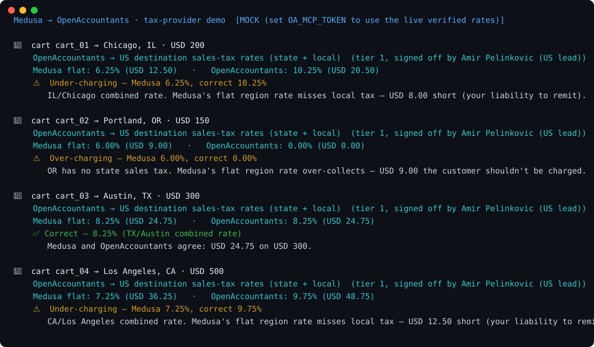

# Medusa → OpenAccountants: illustrative rate comparison

**Fork status**

[](https://app.codacy.com/gh/ryanduguid/medusa-tax-demo/dashboard)

Compare a supplied region rate with a small table of illustrative destination
rates. The Python example reads simplified cart JSON and prints the difference.
It is not a Medusa Tax Module Provider and does not determine the tax a seller
must collect.



## Run it

Python 3.10 or later and the standard library are sufficient.

```bash
python pipeline.py
python pipeline.py samples/carts.json
python -m unittest discover -s tests -v
python make_svg.py
```

The default command and SVG generator always use bundled sample rules.
Empty inputs, incomplete comparisons and invalid inputs return exit code 2;
complete sample comparisons return 0. The generator checks the command result
before replacing the visual.

## What the comparison covers

| Destination | Supplied region rate | Illustrative rate |
|---|---|---|
| Chicago, IL | 6.25% | 10.25% |
| Portland, OR | 6.00% | 0.00% |
| Austin, TX | 8.25% | 8.25% |
| Los Angeles, CA | 7.25% | 9.75% |

These are sample inputs, not a current-rate service. The Los Angeles entry uses
the [CDTFA table effective 1 July 2026](https://cdtfa.ca.gov/taxes-and-fees/rates.aspx),
checked on 26 September 2026. Recheck the applicable rate and effective date
before using any figure outside this example.

Only an explicit state/city entry supplies a complete illustrative rate.
An unknown destination, a state-only rate or an absent nexus entry cannot
establish zero tax. Alaska illustrates why: it has no statewide sales tax but
[local sales taxes can apply](https://www.commerce.alaska.gov/web/dcra/OfficeoftheStateAssessor/AlaskaSalesTaxInformation.aspx).

The calculation assumes that every item in the supplied subtotal is taxable.
It excludes product taxability, exemptions, shipping, fees, marketplace rules,
address resolution, nexus and collection obligations. Results say whether the
region rate matches, exceeds or falls below the sample rate. They do not label
a customer charge legally correct or incorrect.

## Input contract

This is a simplified JSON format, not a verified Medusa API payload:

- `items` contains explicit `unit_price` values in USD and whole-number
  `quantity` values. An empty array means an explicit zero subtotal.
- `currency_code` must explicitly be `usd`; no currency conversion is performed.
- `medusa_region_rate` is a fraction, such as `0.0625` for 6.25%.
- `shipping_address.province` and `shipping_address.city` identify a sample entry.
- Missing numbers remain unknown. Boolean, negative and non-finite numbers are
  rejected. Numeric JSON values or decimal strings may have at most six decimal
  places and values up to `1e12`. Rates must be between zero and one.

Calculations use decimal arithmetic with 50 digits of precision. The demo
rounds tax to cents using half-up rounding; this is an explicit example policy,
not a claim about every jurisdiction's rounding rules.

## Optional live adapter

`python pipeline.py --live` opts into the experimental JSON-RPC adapter and
requires `OA_MCP_TOKEN` to be configured outside the repository. Its live
authentication and response contract have not been verified. It never falls
back to sample rules after a failed live call.

The checker accepts only `rules.schema = "illustrative-rates-v1"` with
`rate_unit = "fraction"` and an explicit `combined_rates` destination map.
Unsupported schemas, units and semantic fields leave the comparison incomplete.
Provider metadata remains reported information, not independent verification.
Bundled rules have no verifier or professional sign-off.

JSON inputs and provider responses reject duplicate object properties and
non-standard numeric constants instead of silently choosing a value.
Control characters in supplied text appear as visible escapes. Redirected
output tolerates encodings that cannot represent the display symbols.

## Files

| File | Role |
|---|---|
| `pipeline.py` | CLI and complete, incomplete or invalid result reporting |
| `medusa_client.py` | Simplified cart JSON extraction and validation |
| `oa_client.py` | Bundled examples and the experimental live adapter |
| `tax_provider.py` | Explicit rate coverage and decimal comparison |
| `values.py` | Shared numeric validation within this demo |
| `samples/carts.json` | Four fabricated carts |
| `reporting.py` | Visible control-character escapes and portable output |
| `json_contract.py` | JSON object and numeric-token validation |
| `tests/` | Offline calculations, input validation and adapter regressions |
